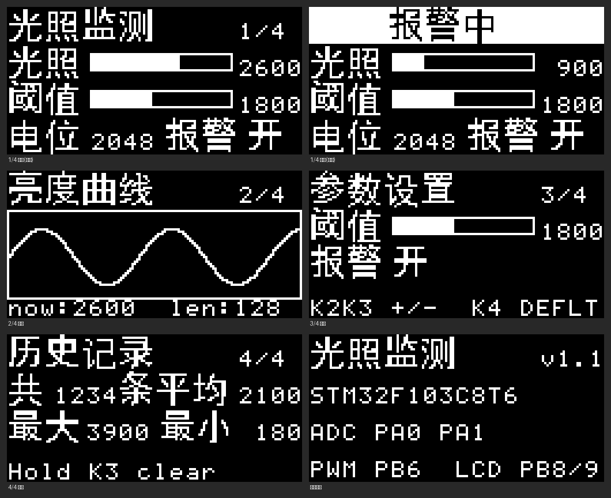

# STM32 光照监测与天黑报警器

基于 **STM32F103C8T6**（标准外设库 SPL）做的一个入门级小项目：光敏传感器实时测环境亮度，
在 0.96 寸 OLED 上以**中文四页界面**显示数值、曲线和统计，天黑到设定阈值以下时蜂鸣器报警。

硬件用的是「铁头山羊 STM32 入门教程（第 4 版）基础套件」，不需要 Flash 模块，接线全部在面包板上完成。



---

## 1. 功能

| 功能 | 说明 |
| --- | --- |
| 双通道采集 | 光敏传感器（PA0）+ 电位器（PA1），8 次均值 + 一阶低通滤波，数值稳定不跳 |
| 中文四页界面 | 16×16 点阵汉字，字库由脚本自动生成，屏幕刷新 5 次/秒 |
| 天黑报警 | 亮度低于阈值时：蜂鸣器间断鸣叫 + 顶部"报警中"反白横幅 + 板载 LED 快闪 |
| 阈值可调 | K2/K3 单击 ±100、长按连续微调 ±20；长按 K4 一键恢复默认值 |
| 静音 | K1 长按静音 30 秒（屏幕显示"静音"） |
| 亮度曲线 | 128 点滚动曲线，约 32 秒窗口 |
| 历史统计 | 每 10 秒记一个样本，内存环形缓冲最多 256 个（约 43 分钟），可看平均/最大/最小，K3 长按清空 |
| 串口上报 | USART1 每 200ms 输出一行 CSV：光照,电位器,阈值,报警开关,统计条数 |

> 说明：本项目**不使用 W25Q64 Flash 模块**，历史统计和阈值设置保存在内存里，掉电后会复位。

## 2. 硬件清单

| 元器件 | 数量 | 在本项目中的作用 |
| --- | --- | --- |
| STM32F103C8T6 最小系统板（蓝板） | 1 | 主控，72MHz |
| ST-Link V2 下载器 | 1 | 下载程序、供电、调试（SWD） |
| 0.96 寸 I2C OLED（128×64） | 1 | 中文界面显示 |
| 光敏传感器模块（LM393 型，4 针） | 1 | 测环境亮度 |
| 电位器（B10K，三脚） | 1 | 第二路模拟量，演示 ADC 双通道 |
| 无源蜂鸣器模块（低电平触发） | 1 | 报警音与按键提示音 |
| 4 脚轻触按键 | 4 | 翻页 / 加 / 减 / 报警开关 |
| USB 转 TTL（CH340） | 1 | 电脑上看串口数据（可选） |
| 面包板 + 杜邦线 | 1 套 | 搭电路 |

## 3. 接线表

| 模块 | 引脚 | 接到蓝板 | 备注 |
| --- | --- | --- | --- |
| OLED | GND / VCC / SCL / SDA | GND / **3V3** / **PB8** / **PB9** | 软件 I2C，VCC 不要接 5V |
| 光敏模块 | AO / GND / VCC | **PA0** / GND / **3V3** | 模块丝印为 `AO DO GND VCC`，DO 不接 |
| 电位器 | 中间脚 / 两边脚 | **PA1** / 3V3 与 GND | 中间脚是滑动端 |
| 蜂鸣器模块 | I/O / GND / VCC | **PB6** / GND / **3V3** | 丝印为 `VCC I/O GND`；**VCC 必须 3.3V** |
| 按键 K1 | 一端 / 另一端 | **PB12** / GND | 内部上拉，按下为低电平，不需要外接电阻 |
| 按键 K2 | 一端 / 另一端 | **PB13** / GND | |
| 按键 K3 | 一端 / 另一端 | **PB14** / GND | |
| 按键 K4 | 一端 / 另一端 | **PB15** / GND | |
| USB 转 TTL（可选） | GND / RXD / TXD | GND / **PA9** / **PA10** | RXD、TXD 交叉接，电源脚不接 |
| ST-Link | SWDIO / SWCLK / GND / 3.3V | PA13 / PA14 / GND / 3V3 | 板子末端 4 针 SWD 排针 |

完整的接线说明、引脚在蓝板上的位置、以及一步步的调试顺序，见 **[my_app/wiring_table.md](my_app/wiring_table.md)**。

## 4. 按键操作

| 操作 | 效果 |
| --- | --- |
| K1 单击 / 连击两下 | 下一页 / 上一页 |
| K1 长按 | 静音 30 秒 |
| K2、K3 单击（在"参数设置"页） | 阈值 +100 / −100 |
| K2、K3 长按 | 阈值连续微调（每 20 一个台阶） |
| K4 单击 | 报警开关（开 / 关） |
| K4 长按（在"参数设置"页） | 阈值恢复默认值 800 |
| K3 长按（在"历史记录"页） | 清空本次上电的统计 |
| 串口发 `p` / `r` / `s` | 立即上报一行 / 清空统计 / 阈值恢复默认 |

## 5. 目录结构

```
stm32模板/
├── user/                    # 用户代码（本项目主要改这里）
│   ├── main.c               # ★ 项目全部功能都在这个文件里
│   ├── system_stm32f10x.c   # 系统时钟（72MHz）
│   ├── stm32f10x_it.c       # 中断服务函数（SysTick 计时）
│   └── ...
├── my_lib/                  # 套件配套的驱动库（OLED / 软 I2C / SPI / 串口 / 按键 / 延时）
│   ├── oled.c / oled.h      #   图形库：画点、线、圆、矩形、位图、字符串
│   ├── si2c.c / si2c.h      #   软件 I2C（OLED 用）
│   ├── button.c / button.h  #   按键状态机：单击 / 连击 / 长按回调
│   ├── usart.c / usart.h    #   串口收发与 printf
│   └── delay.c / delay.h    #   SysTick 毫秒/微秒计时
├── std_periph_driver/       # ST 官方标准外设库（SPL V3.6.0）
├── startup/                 # 启动文件 startup_stm32f10x_md.s
├── my_app/                  # 本项目的辅助资料
│   ├── cn_font_data.h       #   16×16 中文点阵字库（41 个汉字，自动生成）
│   ├── gen_cn_font.py       #   从 TTF 生成中文字库的脚本
│   ├── preview_ui.py        #   在电脑上 1:1 预览 OLED 四个页面 + 缺字检查
│   ├── ui_preview.png       #   界面预览图
│   ├── wiring_table.md      #   ★ 接线表与调试指南
│   └── read_serial.ps1      #   不装串口助手也能看串口数据（PowerShell）
└── stm32模板.uvprojx        # Keil MDK5 工程文件
```

## 6. 编译与烧录

1. 用 **Keil µVision 5（MDK5，ARMCC V5 编译器）** 打开 `stm32模板.uvprojx`；
2. `F7` 编译；
3. 用 ST-Link 接好 SWD 后 `F8` 下载（也可以直接用 ST-Link Utility 烧 `Objects/template.hex`）。

工程已包含全部源文件和包含路径，**不需要额外配置**（芯片：STM32F103C8，ROM 64K / RAM 20K，使用 microLIB）。

> 如果 Keil 里看到中文注释乱码：`Edit → Configuration → Encoding` 选 **UTF-8**，不影响编译结果。

## 7. 实现要点

- **ADC 采集**：ADC1 双通道（PA0/PA1），12MHz ADC 时钟（PCLK2/6），软件触发单次转换 +
  8 次平均 + 一阶低通滤波（`y += (x−y)/4`），做完官方推荐的自校准流程。
- **光敏方向**：不同模块的 AO 极性可能相反。本项目按实机校准：`LIGHT_BIG_IS_BRIGHT = 0`
  表示"光越强原始值越小"，程序里取反后再显示，所以界面上"光照"数字越大 = 越亮。
- **中文显示**：`my_app/gen_cn_font.py` 用 PIL 把黑体渲染成 16×16 点阵（行优先、每行 2 字节、
  MSB 在左），运行期按 UTF-8 解码 → 查表 → `OLED_DrawBitmap` 画出来。字库里没有的字只留空位，
  不会影响其它字，方便排查。
- **无源蜂鸣器**：无源蜂鸣器需要方波才发声，用 TIM4_CH1（PB6）输出 PWM 方波；
  你手上这块是**低电平触发**模块，所以用 PWM 模式 2（比较值 0 → 输出恒高 = 静音），
  代码里用 `BUZZER_ACTIVE_LOW` 一个宏适配两种模块。
- **按键**：使用 `my_lib` 的按键状态机（内部上拉、按下为低电平），支持单击、连击、长按回调，
  长按回调带"连续触发计数"，用来做阈值的连续微调。
- **时间片主循环**：20ms 采样、250ms 曲线、10s 统计、200ms 刷屏 + 串口上报，
  全部用 `GetTick()` 做非阻塞调度，没有 `while` 死等（除了按键提示音这种几十毫秒的短阻塞）。
- **统计**：RAM 环形缓冲（256 个 uint16），记录写指针和已有条数，需要时再算平均/最大/最小。

## 8. 常见问题

| 现象 | 原因与处理 |
| --- | --- |
| 屏幕全黑 | 检查 OLED 的 SCL→PB8、SDA→PB9、VCC→3V3、GND→GND；程序检测不到屏幕时会蜂鸣器长鸣 500ms + LED 快闪 |
| 光照数字反向（遮住反而变大） | 把 `main.c` 里的 `LIGHT_BIG_IS_BRIGHT` 改成相反的值 |
| 报警方向反了 | 改 `ALARM_WHEN_DIM`：1 = 天黑报警，0 = 太亮报警 |
| 蜂鸣器一直响 | ① 模块 VCC 误接了 5V（低电平触发的 PNP 模块必须用 3.3V）；② 模块其实是高电平触发，把 `BUZZER_ACTIVE_LOW` 改成 0 |
| 蜂鸣器不响 | 检查 I/O 是否接到了 PB6（很容易差一格插到 PB7） |
| 串口收到乱码 | 波特率要 115200 8N1，并且 CH340 的 GND 必须和蓝板共地 |
| 按键没反应 | 按键一端接引脚、另一端接 GND；两端接同一侧（内部导通）是无效的 |
| 想改引脚 | 全部集中在 `main.c` 顶部"一、硬件配置区" |

## 9. 可以继续玩什么

- 接回 W25Q64 Flash，把统计和阈值做成掉电保存；
- 加红外遥控（套件里有遥控套装），做遥控调阈值 / 遥控开关报警；
- 加 TT 电机 + 驱动板，做成"天黑自动转的风扇/小车"（套件里有电机调速套件）；
- 加超声波模块做倒车雷达；
- 把串口数据用电脑画成实时曲线（`my_app/read_serial.ps1` 会把数据存成 `data.csv`）。

## 10. 说明与致谢

- 这个仓库原来是我用来**学习 git 和 GitHub** 的（README 里只写过"存放学习笔记、练习代码提交"），
  现在这里放的是我的第一个 STM32 硬件项目，原来的记录仍保留在提交历史里。
- `my_lib/` 驱动库和硬件套件来自 B 站 **铁头山羊** 的《STM32 入门教程（第 4 版）基础套件》，
  本项目仅作个人学习使用；`std_periph_driver/` 为 ST 官方标准外设库。
- 为避免仓库过大，套件自带的字体文件（`my_lib/font/ttfttc/*.ttf`，约 43MB）和字体转换工具没有上传；
  正常编译不需要它们，只有重新生成中文字库时才需要（把 TTF 放回原路径再跑 `gen_cn_font.py`）。
- `my_app/cn_font_data.h` 由 `my_app/gen_cn_font.py` 自动生成，使用的字体是套件里的黑体。
